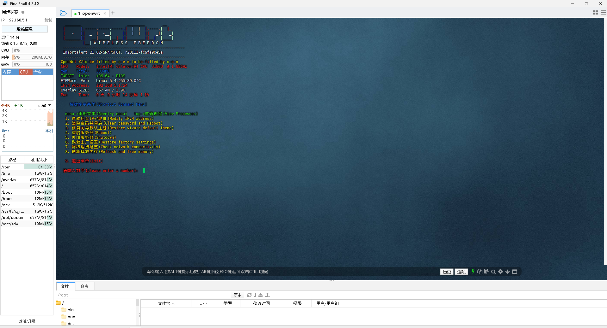
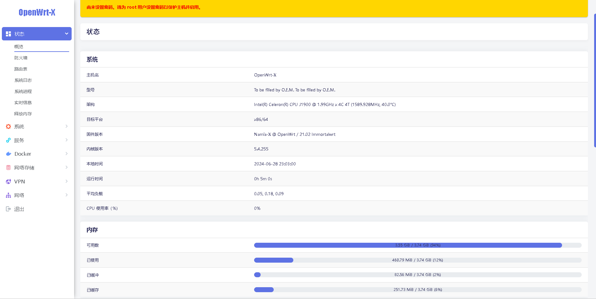
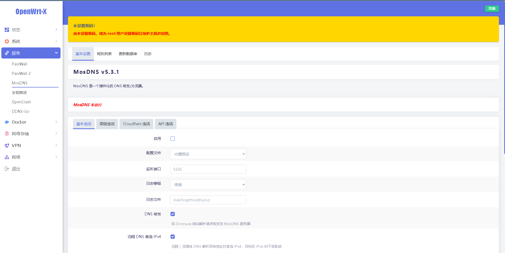
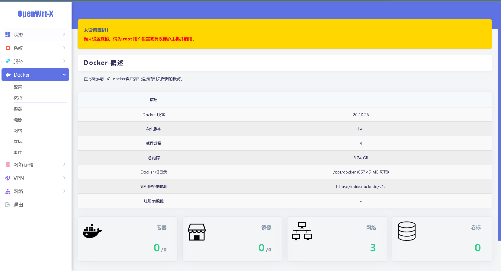
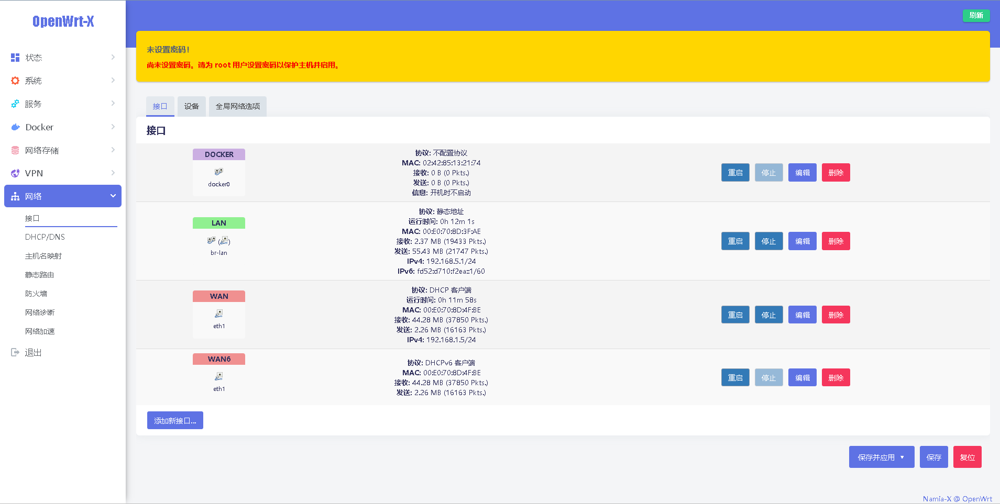

<h3 align="center"><samp> Hi, I'Namia-A👋 </samp></h4> 
<h1 align="center">Fully automatic online compilation💻</h1>
<p align="center"></p> 
<p align="center"><a href=#></a></p> 
<div align="center">

### 基于Actions-OpenWrt自动化在线编译脚本
- 默认IP地址：`192.168.5.1`
- 账户：`root`   密码：`空`

#### 源码来源：
[](https://github.com/immortalwrt/immortalwrt) 
[](https://github.com/coolsnowwolf/lede) 
[](https://github.com/openwrt/openwrt/tree/master)
[](https://github.com/Lienol/openwrt/tree/employ) 

[](https://github.com/immortalwrt/immortalwrt) 
[](https://github.com/coolsnowwolf/lede) 

[](https://github.com/P3TERX/Actions-OpenWrt)

#### 💕💕 点击下表中 [](https://github.com/Namia-A/OpenWrt-X/releases) 即可跳转到该设备固件下载页面💕💕
| 平台+设备名称 | 固件编译状态 | 配置文件 | 固件下载 |
| :-------------: | :-------------: | :-------------: | :-------------: |
| [](https://github.com/Namia-A/OpenWrt-X/blob/main/.github/workflows/Lede.yml) | [](https://github.com/Namia-A/OpenWrt-X/actions/workflows/Lede.yml) | [](https://github.com/Namia-A/OpenWrt-X/blob/main/build/Lede/seed/x86_64) | [](https://github.com/Namia-A/OpenWrt-X/releases/tag/Update-x86) |
| [](https://github.com/Namia-A/OpenWrt-X/blob/main/.github/workflows/Lede.yml) | [](https://github.com/Namia-A/OpenWrt-X/actions/workflows/Lede.yml) | [](https://github.com/Namia-A/OpenWrt-X/blob/main/build/Lede/seed/photonicatWrt) | [](https://github.com/Namia-A/OpenWrt-X/releases/tag/Update-rockchip) |
| [](https://github.com/Namia-A/OpenWrt-X/blob/main/.github/workflows/Lede.yml) | [](https://github.com/Namia-A/OpenWrt-X/actions/workflows/Lede.yml) | [](https://github.com/Namia-A/OpenWrt-X/blob/main/build/Lede/seed/r2c) | [](https://github.com/Namia-A/OpenWrt-X/releases/tag/Update-rockchip) |
| [](https://github.com/Namia-A/OpenWrt-X/blob/main/.github/workflows/Lede.yml) | [](https://github.com/Namia-A/OpenWrt-X/actions/workflows/Lede.yml) | [](https://github.com/Namia-A/OpenWrt-X/blob/main/build/Lede/seed/r2s) | [](https://github.com/Namia-A/OpenWrt-X/releases/tag/Update-rockchip) |
| [](https://github.com/Namia-A/OpenWrt-X/blob/main/.github/workflows/Lede.yml) | [](https://github.com/Namia-A/OpenWrt-X/actions/workflows/Lede.yml) | [](https://github.com/Namia-A/OpenWrt-X/blob/main/build/Lede/seed/r4s) | [](https://github.com/Namia-A/OpenWrt-X/releases/tag/Update-rockchip) |
| [](https://github.com/Namia-A/OpenWrt-X/blob/main/.github/workflows/Lede.yml) | [](https://github.com/Namia-A/OpenWrt-X/actions/workflows/Lede.yml) | [](https://github.com/Namia-A/OpenWrt-X/blob/main/build/Lede/seed/r5s) | [](https://github.com/Namia-A/OpenWrt-X/releases/tag/Update-rockchip) |
| [](https://github.com/Namia-A/OpenWrt-X/blob/main/.github/workflows/Lede.yml) | [](https://github.com/Namia-A/OpenWrt-X/actions/workflows/Lede.yml) | [](https://github.com/Namia-A/OpenWrt-X/blob/main/build/Lede/seed/n1) | [](https://github.com/Namia-A/OpenWrt-X/releases/tag/20230723055753) |
| [](https://github.com/Namia-A/OpenWrt-X/blob/main/.github/workflows/Lede.yml) | [](https://github.com/Namia-A/OpenWrt-X/actions/workflows/Lede.yml) | [](https://github.com/Namia-A/OpenWrt-X/blob/main/build/Lede/seed/phicomm_k2p) | [](https://github.com/Namia-A/OpenWrt-X/releases/tag/a20230723075212) |


### 💕💕文化有限正在学习中💕💕
- ================================================================
- 第一点、X86_64固件本人尽量用最新master或者23.05分支，用6.1和6.6的内核来结合编译编译出来的都可以使用自行U盘或者PE安装。
- 第二点、ram架构rk3568光影猫暂时天灵23.05、5.1能使用，lede测试中！主要是基于本人有啥硬件设备。
- 第三点、主分支就是默认提示的，但是不包括23.05或者22.21.19.18.或者其他......会出现6.6的内核,但是会出现在编译插件安装过程中会莫名缺失你的seed文件里面所标记的设备配置文件，原因是其中个别插件带的依赖和你编译得插件或者其他插件有冲突他会消失。
- 第四点、禁止6.1-6.6内核安装luci-app-netspeedtest!!!!!!!会报错。

             我是一个没有感情的虚线-.-！【正在测试lede】源码设备光影猫，测试出来会在【必看项】表明💕!
             总插件N个，我装插件安装的数量基于x86有【54个】未安装【N个】
             特例-不是很推荐xwrt主分支此分支同步的是官方主分支你可以尝试其他xwrt分支！

- [`必看项！！！💕`](https://github.com/Namia-A/OpenWrt-X/blob/main/backups/%E5%B7%B2%E7%BC%96%E8%AF%91%E8%AF%B4%E6%98%8E/txt)
- [`插件对照表！！！💕`](https://raw.githubusercontent.com/Namia-A/OpenWrt-X/main/backups/%E6%8F%92%E4%BB%B6%E5%AF%B9%E7%85%A7%E8%A1%A8/txt)
- 首先需要打开 Openwrt 主页,点击系统-TTYD 命令窗,或者使用```putty```或者```openwrt```后台luci插件在线更新 
- 输入`openwrt`即可进入固件升级菜单                            
- 输入`tools`即可打开工具箱
- 输入`qinglong`即可全自动安装青龙 
- ================================================================

- ================================================================
- 自行云编译固件姿势
- ssh-actions改为ssh就可以启动插件选择
- 看到ssh链接会有一个web的链接，打开就是命令行，根据下面命令进入
- 开始 ctrl+c 
- 进ssh选择插件 
``` bash
cd openwrt && make menuconfig
```
- 结束ctrl+d
- REPO_TOKEN密匙制作教程：https://git.io/jm.md
- 云编译需要 [在此](https://github.com/settings/tokens) 创建个```token```,勾选：```repo```, ```workflow```，保存所得的key
- 然后在此仓库```Settings```->```Secrets```中添加个名字为```REPO_TOKEN```的Secret,填入token获得的key

- TG通知```Settings```->```Secrets```中添加个名字为```TELEGRAM_BOT_TOKEN```和```TELEGRAM_CHAT_ID```
- ================================================================
- 
## 自动更新固件用的不朽固件作为示列图片
- 
- 
- 
- 
- 
- 
### 另外单独鸣谢！🎉
 以下各位大佬（排名无分先后）<br />
 
 [`coolsnowwolf`](https://github.com/coolsnowwolf/lede/tree/master)
 [`Lienol`](https://github.com/Lienol/openwrt/tree/21.02)
 [`immortalwrt`](https://github.com/immortalwrt/immortalwrt)
 [`openwrt`](https://github.com/openwrt/openwrt)
 [`x-wrt`](https://github.com/x-wrt/x-wrt)
 [`P3TERX`](https://github.com/P3TERX/Actions-OpenWrt)
 [`dhxh`](https://github.com/dhxh/Openwrt-Build)
 [`ophub`](https://github.com/ophub/amlogic-s9xxx-openwrt)
 [`klever1988`](https://github.com/klever1988/cachewrtbuild)
 [`actions`](https://github.com/actions/upload-artifact)
 [`svenstaro`](https://github.com/svenstaro/upload-release-action)
 [`jerrykuku`](https://github.com/jerrykuku/luci-theme-argon)
 [`281677160`](https://github.com/281677160/bendi)
 [`OpenWrtLi`](https://github.com/OpenWrtLi/OpenWrtli)
</div>

### Friendly sociability
- [](https://t.me/+LPeqwOcUjk40ZjRl)
- [](https://github.com/Namia-A)
- [](mailto:kmy258855@gmail.com)
